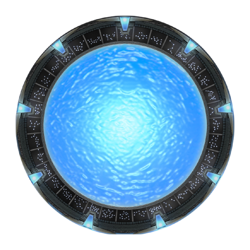

<h1 align="center">Thecube Launcher</h1>

<em><h5 align="center">Original Source: <a href="https://github.com/dscalzi/HeliosLauncher">dscalzi/HeliosLauncher</a></h5></em>

[
](https://travis-ci.com/DebansCommunity/TheCubeLauncher)  

Join modded servers without worrying about installing Java, Forge, or other mods. We'll handle that for you.
